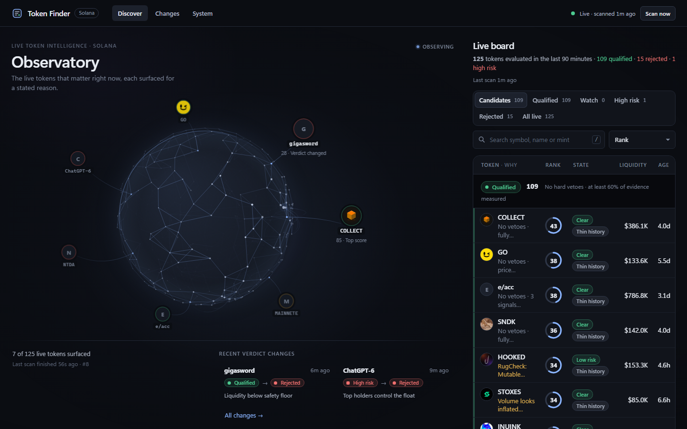
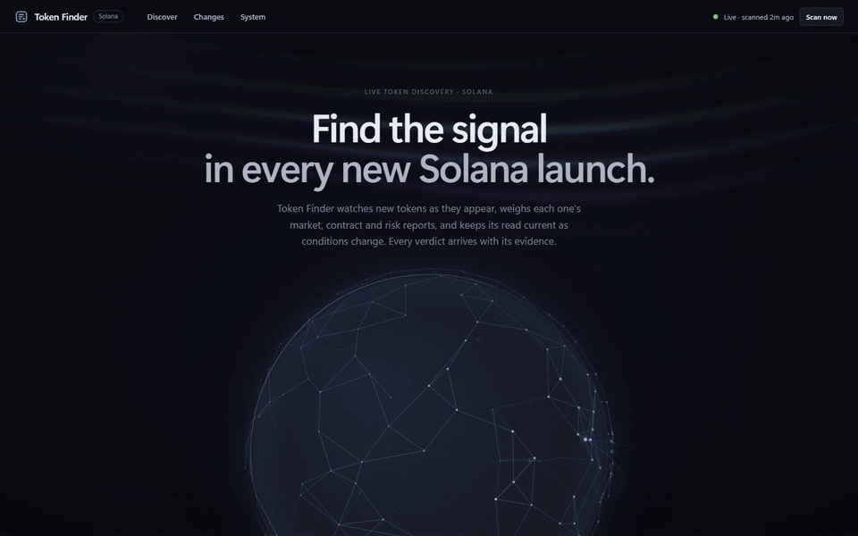
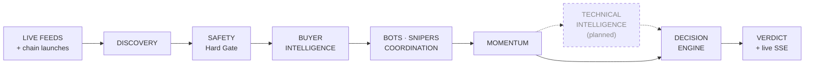
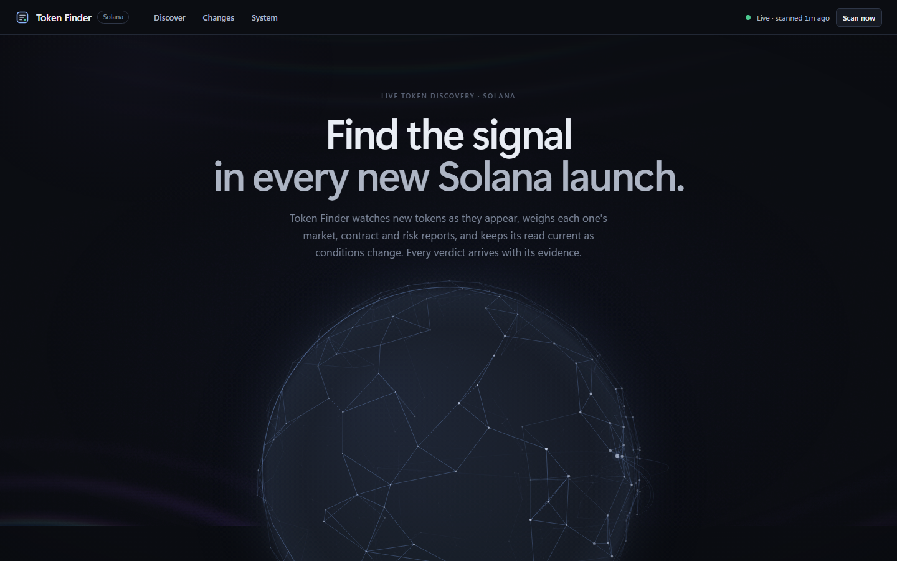
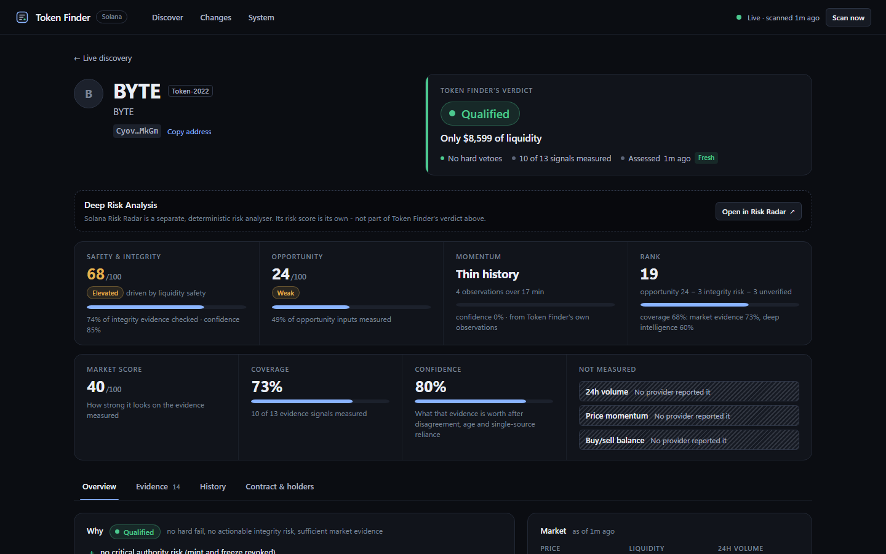
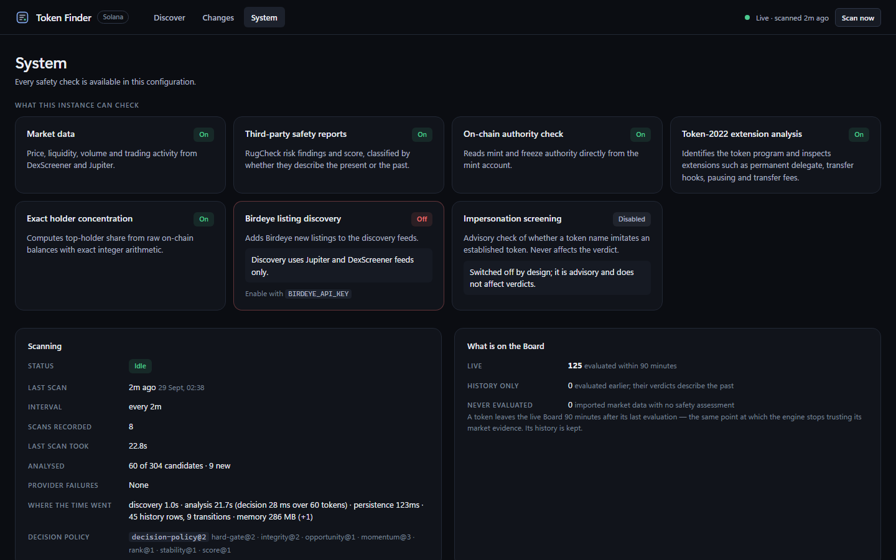
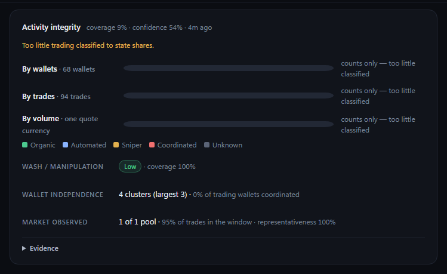
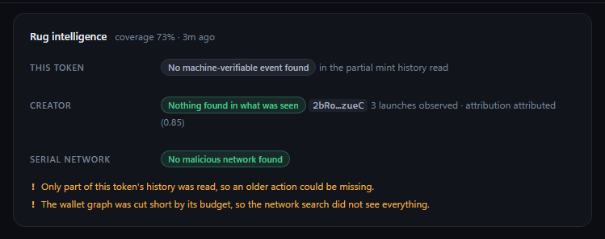
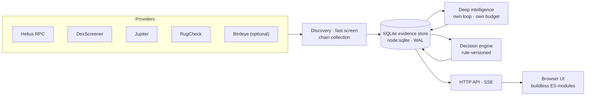
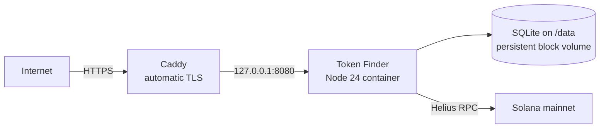

<div align="center">

# Token Finder

**Live intelligence for new Solana tokens. Every verdict arrives with its evidence.**

Token Finder discovers newly launched Solana tokens, checks who is really behind
the activity, and decides which of them can be trusted enough to watch - then
keeps that read current as conditions change.

**[▶ Live demo](https://130-61-32-89.sslip.io)** &nbsp;·&nbsp;
**[X / Twitter](https://x.com/danialsafarli)** &nbsp;·&nbsp;
**[Email](mailto:danialsafarli@gmail.com)** &nbsp;·&nbsp;
**[One-minute tour](DEMO.md)**



</div>

<details open>
<summary><b>See it move</b> - Landing → Board → a token's Dossier → its verdict (real production data, ~11 s)</summary>
<br>

</details>

> **Read-only by design.** Token Finder reads public market and chain data and
> produces verdicts. It holds no keys, signs nothing and trades nothing.
> Nothing here is financial advice.

---

## Why Token Finder

Most new Solana tokens are noise, and many are traps. A price chart cannot tell
you whether the buyers are real people or a bot farm, whether the creator has
drained pools before, or whether "no risk found" means *safe* or *never checked*.

| The usual screener | Token Finder |
|---|---|
| A single score that blends safety and hype | **Safety and opportunity are separate numbers.** Momentum can never lift a verdict |
| Missing data quietly counts as zero risk | **Unknown is never zero.** What was not measured is shown, and costs rank |
| Trusts volume at face value | **Asks who is trading** - organic, automated, snipers, coordinated wallets, wash |
| A verdict with no explanation | **Every verdict explains itself** - reasons, risks, what blocks a better one, coverage - and every change is recorded |

---

## Intelligence pipeline



| Stage | What happens | Where |
|---|---|---|
| **Live feeds** | Jupiter (recent, organic), DexScreener (profiles, boosts), Birdeye (new, optional) every 2 min, plus pump.fun launches read from the chain every 60 s | `core/discover.ts`, `ingest/` |
| **Discovery** | Candidates merged across feeds; a mint seen by several feeds is a stronger signal | `core/discover.ts` |
| **Safety** | Mint and freeze authority, Token-2022 extensions, exact holder concentration, RugCheck findings, liquidity floor. Any **hard fail rejects outright** | `core/analyze.ts`, `decision/gate.ts` |
| **Buyer intelligence** | Wallet profiles from their own history: age, cadence, entry speed, hold time, first funding | `intel/features.ts`, `intel/funding.ts` |
| **Bots · snipers · coordination** | Sniper, HFT and automated-trader classes; a wallet graph with shared-funder and same-slot coordinated-entry links; clusters; wash and round-trip detection | `intel/classify.ts`, `graph.ts`, `cluster.ts`, `wash.ts` |
| **Rug intelligence** | Launch attribution, machine-verifiable security events (supply expansion, freeze abuse, liquidity drain, creator dump), creator history and serial networks | `intel/attribution.ts`, `security.ts`, `creator.ts` |
| **Momentum** | Momentum v2 from Token Finder's **own** stored observations - never used to lift a verdict | `decision/momentum.ts` |
| **Technical intelligence** | *Planned, not implemented* - chart structure from OHLCV candles | [TECHNICAL_INTELLIGENCE.md](TECHNICAL_INTELLIGENCE.md) |
| **Decision engine** | Rule-versioned verdict from stored rows only, ~0.5 ms per token; seven integrity domains; re-decided after every intelligence cycle | `decision/` |
| **Verdict** | Six verdicts, ranked, pushed to every open browser over Server-Sent Events | `server/` |

**Six verdicts, first match wins:** `Rejected` (a hard fail) → `Insufficient data`
→ `High risk` (serious soft risk on *confident, covered* evidence) → `Watch` →
`High potential` → `Qualified`. Danger applies at once; an improvement must be
confirmed by a second reading. Full rules: **[DECISION_ENGINE.md](DECISION_ENGINE.md)**.

---

## Key features

| | Capability |
|---|---|
| 🔭 | **Real-time Solana discovery** - four to five market feeds plus launches read directly from the chain |
| 🛡️ | **Safety first** - on-chain authorities, Token-2022 extensions, exact holder math (role-aware: pools, curves and programs are not "whales"), RugCheck, liquidity |
| 👥 | **Holder analysis** - top-10 share raw and wallets-only, program and pool holdings separated, provider disagreement kept visible |
| 🧬 | **Buyer authenticity** - every buyer classified `SNIPER`, `HIGH_FREQUENCY_TRADER`, `AUTOMATED_TRADER`, `LIKELY_ORGANIC` or `UNKNOWN`; nothing is ever labelled human |
| 🕸️ | **Wallet graph and clustering** - funding, shared funders, transfers, coordinated entry within 2 slots, repeated order sizes; graded links, clusters over strong ones only |
| 🔁 | **Wash detection** - concentration, round trips, recurring sizes and related-wallet volume, with every threshold reported |
| 🧨 | **Creator and rug intelligence** - who launched it, what they did before, and who they are connected to |
| 📈 | **Momentum** - from observed history, with its confidence; a trend needs time, and says so |
| ⚖️ | **Decision engine** - hard gate, seven integrity domains, opportunity kept apart, ranking that charges for what could not be checked |
| 📄 | **Dossier** - one page per token: verdict and why, four separate numbers, Activity integrity, Rug intelligence, evidence and history tabs |
| 🌐 | **Board and Observatory** - the live ranking with segments, search and keyboard navigation, beside a live network sphere of the tokens that matter now |
| 🔄 | **Changes** - every verdict transition with its reasons, never pruned |
| 🩺 | **System** - which checks are on, degraded or off; provider, ingestion, intelligence and database health; the decision policy and rule versions |
| 🧭 | **Risk Radar hand-off** - *Deep Risk Analysis* opens [Solana Risk Radar](https://solana-risk-radar.vercel.app), a separate deterministic analyser whose score stays its own |

---

## Screenshots

All captured from the live production instance - real tokens, real data, nothing staged.

| | |
|---|---|
| <br>**Landing** - what it is, and the two ways in: read one token, or scan live | <br>**Discover** - the Observatory and the live Board |
| <br>**Dossier** - the verdict, and safety, opportunity, momentum and rank side by side, never combined | <br>**System** - what this instance can check, and how the last scan went |
| <br>**Activity integrity** - who traded it, by wallets, trades and volume. Here the sample is still too thin, and the panel says so instead of guessing | <br>**Rug intelligence** - the token's own record, its creator and their network, with what could not be read |

---

## Product principles

| Principle | In practice |
|---|---|
| **Unknown ≠ safe** | An unanalysed token is at most *Qualified*, and "nothing found in a thin sample" is never counted as clean |
| **Missing evidence ≠ positive evidence** | Missing evidence earns no points and lowers coverage. `UNKNOWN`, `INSUFFICIENT_DATA` and `NOT_MEASURED` are correct answers |
| **Safety ≠ opportunity** | Integrity and opportunity are scored apart; a token can have strong momentum and still be *Rejected* |
| **Score, coverage and confidence are three numbers** | Never multiplied together. A thin sample can inform a verdict but not condemn a token |
| **Provider disagreement stays visible** | Resolved conservatively for safety facts, with every provider's claim kept |
| **Stale evidence asserts nothing** | Old readings can be neither a veto nor a penalty |
| **Deterministic decisions** | Every verdict is computed from stored rows by rule-versioned code; a rule change that can change a conclusion bumps its version. No randomness exists in any verdict path (`Math.random` appears only in the Observatory's animation) |
| **No fake intelligence** | No simulated data, no fabricated confidence, probability or target. Calibration ran against a replay of real stored history - [CALIBRATION.md](CALIBRATION.md) |

---

## Testing and reliability

| | |
|---|---|
| **661 automated tests** | declared in source at the current release: **590** unit and integration (`npm test`) and **71** real-browser UI tests (`npm run test:ui`) |
| **Real-browser UI tests** | the product in headless Chrome/Edge over the DevTools protocol with real pointer, touch and key input - including a hostile token that must not execute |
| **Type safety** | `tsc` over the server, then the browser code (JSDoc-typed) |
| **Lint** | the render boundary, CSP-compatible markup and the persistence boundary are enforced |
| **Restart integrity** | a scan, a hard kill, a restart: same scan and verdict counts, `PRAGMA integrity_check` ok |
| **Live verification** | chain collection and deep intelligence verified against mainnet through Helius ([DEEP_INTELLIGENCE.md §15](DEEP_INTELLIGENCE.md), [DECISION_ENGINE.md §13](DECISION_ENGINE.md)) |

```bash
npm run check    # typecheck + lint + unit/integration + browser UI
```

---

## Architecture



**One long-lived Node process** runs the dashboard, the scanner (every 2 min),
chain collection (every 60 s) and deep intelligence (every 5 min, 2-4 tokens
chosen by stated priority) side by side, over **one SQLite database**. Each
loop has its own request and time budget; what a budget cuts is recorded as
truncation and lowers coverage. Details: [ARCHITECTURE.md](ARCHITECTURE.md),
[PIPELINE.md](PIPELINE.md), [DATA_BACKBONE.md](DATA_BACKBONE.md),
[PERSISTENCE.md](PERSISTENCE.md).

---

## Data providers

| Provider | Used for | Needs a key |
|---|---|---|
| **Helius** | on-chain authorities, Token-2022, exact holders, chain collection, wallet histories (oldest-first funding) | `HELIUS_API_KEY` - strongly recommended |
| **DexScreener** | discovery (profiles, boosts), pairs, price, liquidity, volume | no |
| **Jupiter** | discovery (recent, organic), token metadata and audit fields | no |
| **RugCheck** | third-party risk findings, classified as present or past | no |
| **Birdeye** | an extra new-listing feed | `BIRDEYE_API_KEY` - optional (off in production) |
| **Solana public RPC** | fallback chain reads when no Helius key is set (~1 request/s) | no |

It runs with **no key at all**. Without Helius, the on-chain checks and deep
intelligence are reported as UNAVAILABLE - never assumed clean. Every provider,
measured: [DATA_SOURCES.md](DATA_SOURCES.md).

---

## Production deployment

**Live at [https://130-61-32-89.sslip.io](https://130-61-32-89.sslip.io)**



| | |
|---|---|
| **Host** | Oracle Cloud, Frankfurt (eu-frankfurt-1), one ARM VM |
| **HTTPS** | Caddy with automatic certificates; HTTP redirects to HTTPS; the app port is never public |
| **Persistence** | SQLite on a dedicated block volume, mounted by UUID; the container waits for it at boot |
| **Live updates** | Server-Sent Events push scans, stages and verdict changes to every open browser |
| **Recovery** | Docker and Caddy restart on boot - verified with a real reboot: the site returned on its own with its data intact |
| **On-chain data** | Helius-backed chain collection and deep intelligence |
| **One writer** | exactly one instance: SQLite has one writer |
| **Public limits** | analyses, manual scans, API reads and live streams bounded per client and globally (`429` + `Retry-After`) |

Deploy your own (Docker Compose behind any HTTPS proxy, or Fly.io):
**[DEPLOYMENT.md](DEPLOYMENT.md)**.

---

## Tech stack

| Layer | Choice |
|---|---|
| Runtime | **Node 24**, native TypeScript - no build step |
| Dependencies | **zero at runtime**; `typescript` and `@types/node` for type-checking only |
| Storage | `node:sqlite` (WAL), versioned migrations, retention policies |
| Chain access | Helius JSON-RPC over `fetch` - no web3 SDK, by design |
| Server | `node:http`, JSON DTOs, Server-Sent Events |
| Frontend | buildless ES modules, no framework, one escaping HTML template, a canvas Observatory |
| Tests | `node:test`, plus a zero-dependency headless-Chrome driver |
| Production | Docker, Caddy, Oracle Cloud ARM |

---

## Security and safety

- **No keys, no signing, no trading.** Nothing in the code can move funds.
- **Secrets stay server-side.** Keys are read only by `src/config.ts`; no key
  reaches a response or the browser - `/api/status` reports booleans.
- **Hostile token data is expected.** Names, symbols and links are
  attacker-controlled: one escaping HTML sink, `http(s)` URLs only, no event
  handlers or `style` attributes - enforced by lint and by a UI test that
  renders a hostile token.
- **Strict headers.** A CSP with no `unsafe-inline` or `unsafe-eval`,
  `nosniff`, `frame-ancestors 'none'`, `Referrer-Policy: no-referrer`.
- **Host and Origin checks.** A Host allowlist against DNS rebinding;
  state-changing requests must come from the public origin.
- **Bounded public use.** Per-client and global limits protect the provider budget.

---

## Local development

```bash
git clone https://github.com/Danialsafarli/token-finder.git
cd token-finder
cp .env.example .env        # optional: add HELIUS_API_KEY
node src/cli.ts serve       # http://localhost:5173
```

Requires Node 24 (native TypeScript). No `npm install` is needed to run it;
install only to type-check.

<details>
<summary><b>Commands</b></summary>

| Command | What it does |
| --- | --- |
| `node src/cli.ts serve` | Dashboard plus the monitor, chain collection and deep intelligence. The default. |
| `node src/cli.ts scan` | One discovery pass; prints the top 10 and any events. |
| `node src/cli.ts rank [n]` | The current ranking from stored state, no network. |
| `node src/cli.ts watch` | The monitor in the terminal, no dashboard. |
| `node src/cli.ts analyze <mint\|symbol>` | One token, with the full breakdown. |
| `node src/cli.ts discover` | The candidate mints each feed returned. |
| `node src/cli.ts ingest` / `chain` / `activity <mint>` | One chain-collection cycle; what has been collected; one token's trades and buyers. |
| `node src/cli.ts intel-run` / `intel <mint> [--run]` | One deep-intelligence cycle; one token's stored intelligence. |
| `node src/cli.ts calibrate [--db path] [--json out]` | Replay stored verdicts against measured outcomes (read-only; use a copy). |
| `node src/cli.ts db` / `reset` / `typesafe-check` | Database diagnostics; clear stored state; check TypeSafe credentials. |

| Script | What it runs |
| --- | --- |
| `npm run typecheck` | `tsc` over the server, then the browser code (JSDoc-typed). |
| `npm run lint` | `scripts/lint.mjs`: the render boundary, CSP-compatible markup and the persistence boundary. |
| `npm test` | Unit and integration tests, plus render-boundary tests for the browser code. |
| `npm run test:ui` | The product in a real headless Chrome or Edge. Skips, saying so, without a Chromium browser (`CHROME_PATH` overrides). |
| `npm run check` | All four. |

</details>

<details>
<summary><b>Configuration</b></summary>

Every key is optional. Keys are read only by `src/config.ts`, server-side.

| Variable | Default | Meaning |
| --- | --- | --- |
| `HELIUS_API_KEY` | - | On-chain authority, Token-2022, exact holders, chain collection, deep intelligence. |
| `BIRDEYE_API_KEY` | - | Birdeye's new-listing feed. |
| `PORT` / `HOST` | `5173` / `127.0.0.1` | Bind. Loopback by default; anything else exposes the dashboard and turns on the public access limits. |
| `SCAN_INTERVAL_SEC` | `120` | Seconds between scans. |
| `LIVE_WINDOW_MIN` | `90` | How long a token stays on the live Board after its last evaluation. |
| `MIN_LIQUIDITY_USD`, `MAX_AGE_HOURS`, `MAX_ANALYZE_PER_SCAN` | `3000`, `168`, `60` | Discovery and fast-screen bounds. |
| `MIN_COVERAGE_QUALIFY` / `MIN_COVERAGE_WATCH` | `0.6` / `0.35` | Market-evidence coverage for Qualified / below which a token is Insufficient data. |
| `CATASTROPHIC_CONCENTRATION_PCT` | `90` | Top-holder share that hard-fails. |
| `INGEST_ENABLED`, `INTEL_ENABLED` | `true` | Chain collection and deep intelligence beside the monitor (`serve` only). |
| `INTEL_TOKENS_PER_CYCLE` / `INTEL_MAX_TOKENS_PER_CYCLE` | `2` / `4` | Tokens per deep cycle; more only when measured cost shows the budgets fit them. |
| `INTEL_REQUESTS_PER_CYCLE` / `INTEL_CYCLE_MAX_MS` | `150` / `90000` | The hard budget every deep stage draws on. |
| `RETENTION_HISTORY_DAYS` / `RETENTION_EVIDENCE_DAYS` | `90` / `14` | History kept; per-metric evidence kept for ordinary snapshots (transitions keep theirs). |
| `TOKEN_FINDER_DATA_DIR` | `data` | Where the database lives. |
| `PUBLIC_ORIGIN`, `ADMIN_TOKEN`, `ANALYZE_PER_*`, `SCAN_*`, ... | - | Public hosting; see [DEPLOYMENT.md](DEPLOYMENT.md). |
| `RISK_RADAR_URL` | `https://solana-risk-radar.vercel.app` | Where Deep Risk Analysis hands the mint. |
| `TYPESAFE_API_KEY` / `TYPESAFE_ENABLED` | - / `false` | Advisory impersonation screening. **Off**, and it never affects a verdict. |

The rest are in `.env.example`.

</details>

<details>
<summary><b>HTTP API</b></summary>

View-shaped DTOs (`src/server/dto.ts`), gzipped over 1 KB.

| Endpoint | Returns |
| --- | --- |
| `GET /api/board?segment=&q=&sort=&limit=` | The live Board. |
| `GET /api/tokens/:mint` | The Dossier for one token, live or not. |
| `GET /api/tokens/:mint/history` | Verdict changes and the score, market and holder series. |
| `POST /api/analyze` `{"mint": "..."}` | Analyses one token; streams NDJSON `stage` lines, then `done`. Same-origin only. |
| `POST /api/scan` | Starts a scan. Same-origin only. |
| `GET /api/orb`, `/api/changes`, `/api/events` | The Observatory; verdict changes and alerts; recent events. |
| `GET /api/system`, `/api/status`, `/api/coverage` | Capabilities, health, policy, timings; scan state and active keys (booleans); live-universe coverage. |
| `GET /api/intel/:mint` | One token's stored deep intelligence (diagnostic). |
| `GET /api/stream` | SSE: `hello`, `scan-start`, `scan-stage`, `scan`, `scan-failed`, `decision`, `alert`. |
| `GET /healthz`, `/readyz` | Liveness; readiness (database healthy, recent scan). |

</details>

---

## Current limitations

- **Calibration is thin.** 98% of past decision points have no measured
  outcome, because tokens leave the feeds; most thresholds are reasoned
  starting points ([CALIBRATION.md](CALIBRATION.md)).
- **High potential is currently unreachable** - no token has yet shown the
  momentum history and deep coverage it requires.
- **Deep intelligence reaches 2-4 tokens a cycle.** Most live tokens are
  unanalysed at any moment, are at most Qualified, and the product says so.
- **Samples are bounded** - at most 12 wallets per token and the newest 100
  transactions per wallet; thin readings are capped rather than trusted.
- **No dedicated bundler classifier.** Coordinated entry (first buys within 2
  slots) and shared-funder clusters are the coordination signals today.
- **Discovery is polled**, not streamed: feeds every 2 min, chain launches every 60 s.
- **Providers vary** - DexScreener can return different pair sets between
  reads; liquidity is only compared within one pool, and each adapter fails soft.

## Roadmap

| Next | |
|---|---|
| **Outcome tracking** after tokens leave the feeds - what calibration needs most | planned |
| **Technical intelligence** - chart structure from OHLCV candles ([spec](TECHNICAL_INTELLIGENCE.md)) | specified, not implemented |
| **Realtime ingestion** - websocket/gRPC pool events instead of polled feeds | planned |
| **Watchlists and alerts** delivered outside the dashboard | planned |
| **Trading** - paper trading first, each step gated on the last | not started; no key handling without explicit approval |

Status of everything, implemented or not: **[ROADMAP.md](ROADMAP.md)**.

---

## Documentation

| File | Contents |
| --- | --- |
| [DEMO.md](DEMO.md) | The one-minute path through the product, for reviewers. |
| [DECISION_ENGINE.md](DECISION_ENGINE.md) | Verdicts: the intelligence contract, rule versions, Hard Gate v2, integrity, opportunity, Momentum v2, the ladder, stability, ranking. |
| [DEEP_INTELLIGENCE.md](DEEP_INTELLIGENCE.md) | Actor analysis: buyer classes, funding, the wallet graph, clusters, wash, attribution, security events, creator history, serial networks. |
| [PIPELINE.md](PIPELINE.md) | The fast screen: provider validation, the evidence model, cross-provider resolution, coverage and confidence. |
| [CALIBRATION.md](CALIBRATION.md) | The replay over real history, the outcome model, what changed and why. |
| [DATA_BACKBONE.md](DATA_BACKBONE.md) | On-chain collection: launches, transactions, the canonical event model, budgets, gaps. |
| [PERSISTENCE.md](PERSISTENCE.md) | SQLite schema, migrations, deduplication, retention, failure behaviour. |
| [DATA_SOURCES.md](DATA_SOURCES.md) | Every provider, measured. |
| [DEPLOYMENT.md](DEPLOYMENT.md) | Production architecture, access limits, storage, and how to deploy. |
| [SCORING.md](SCORING.md) | The market score (shown beside the decision, never the ranking key). |
| [ARCHITECTURE.md](ARCHITECTURE.md) | The architecture record and the long-range design. |
| [ROADMAP.md](ROADMAP.md) | What is implemented, provider-dependent, limited, or future. |
| [docs/adr/](docs/adr/) | Architecture decision records. |

---

## Creator

**Built by Danial Safarli**

[X / Twitter](https://x.com/danialsafarli) &nbsp;·&nbsp;
[danialsafarli@gmail.com](mailto:danialsafarli@gmail.com) &nbsp;·&nbsp;
[GitHub](https://github.com/Danialsafarli)
